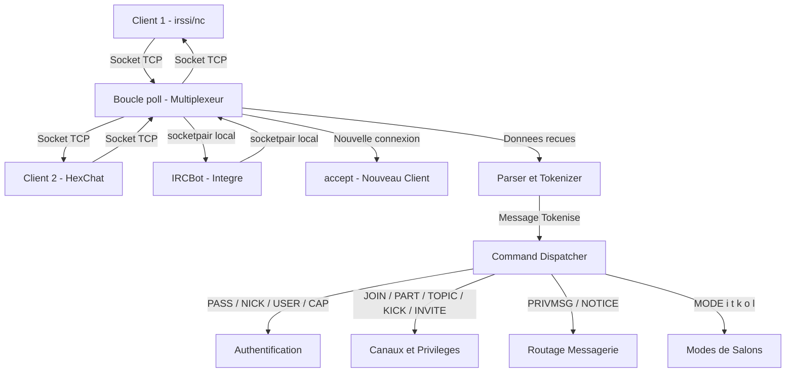

# 🌐 `ft_irc` — Serveur IRC en C++98

*Projet d'infrastructure réseau réalisé dans le cadre du cursus de l'École 42 par **abdoali** & **agallot**.*

---

## 📝 Description

`ft_irc` est un serveur de messagerie instantanée conforme au protocole IRC (sous-ensemble des **RFC 1459 et RFC 2812**). 

Il est entièrement implémenté en **C++98** et fonctionne sur un **unique thread**. L'asynchronisme et la gestion simultanée des clients reposent sur l'I/O non-bloquant via l'appel système **`poll()`** (multiplexage de sockets).

---

## 🏗️ Architecture Générale du Serveur

Voici comment les flux réseaux et les commandes logiques sont orchestrés au sein du processus :



---

## 🛠️ Commandes Supportées

Le serveur gère le routage et les réponses d'erreur normalisées pour les commandes suivantes :

*   **Authentification** : `PASS`, `NICK`, `USER`, `CAP` (compatibilité de négociation).
*   **Contrôle des canaux** : `JOIN` (incluant `JOIN 0` pour quitter tous les salons), `PART`, `TOPIC`, `KICK`, `INVITE`.
*   **Modes de canaux** : `MODE` avec support complet de :
    *   `+i` / `-i` : Canal sur invitation uniquement
    *   `+t` / `-t` : Modification du sujet restreinte aux opérateurs
    *   `+k` / `-k` : Définition d'un mot de passe (clé d'accès)
    *   `+l` / `-l` : Définition d'une limite maximale de membres concurrents
    *   `+o` / `-o` : Promotion ou destitution d'un opérateur
*   **Messagerie** : `PRIVMSG`, `NOTICE` (messages silencieux sans erreurs de boucle).
*   **Utilitaires & Infos** : `PING`, `PONG`, `WHOIS`, `QUIT`.

---

## 🚀 Guide Rapide

### 1. Compilation

> [!IMPORTANT]
> Le projet exige un compilateur compatible C++98 (`c++` ou `g++`).

```bash
make          # Construit le binaire 'ircserv'
make clean    # Supprime les fichiers objets (.o)
make fclean   # Nettoie les objets et le binaire final
make re       # Force la recompilation complète
```

### 2. Lancement du Serveur

Démarrez le serveur en spécifiant un port réseau et un mot de passe de connexion :
```bash
./ircserv <port> <password>
```
*Exemple :* `./ircserv 6667 secret`

### 3. Connexion Client

Vous pouvez vous connecter avec n'importe quel client IRC standard (ex: `irssi`, `WeeChat`, `HexChat`). 

Pour tester rapidement en ligne de commande brute via Netcat :
```bash
nc 127.0.0.1 6667
PASS secret
NICK testnick
USER testuser 0 * :Mon Nom Réel
```

---

## 🧪 Suite de Tests d'Intégration

Nous avons conçu une suite de tests modulaire, verbeuse et connectée aux guides techniques pour simplifier le débogage.

```
tests/
├── run_tests.py         # Point d'entrée du testeur
├── framework.py         # Moteur de tests avec couleurs et extraits de docs
├── irc_client.py        # Client de simulation avec historique de trafic
└── suites/              # 27 tests unitaires / intégration par phases
```

Pour exécuter les tests :
```bash
python3 tests/run_tests.py [password] [--verbose[=True/3/False]]
```

> [!TIP]
> Lancez `python3 tests/run_tests.py --verbose=3` pour obtenir un diagnostic complet avec **tracebacks**, **logs de trafic réseau détaillés (entrées/sorties)**, et des **explications extraites en direct des guides techniques** (`docs/*.md`) !
> Pour plus d'informations sur le testeur, consultez le [README du testeur](file:///wsl.localhost/Ubuntu/home/abdoali/42cursus/cercle-6/ft_irc/tests/README.md).

---

## 📚 Références & Protocoles

*   [RFC 1459 — Internet Relay Chat Protocol](https://tools.ietf.org/html/rfc1459)
*   [RFC 2812 — IRC: Client Protocol](https://tools.ietf.org/html/rfc2812)
*   [Modern IRC Documentation](https://modern.ircdocs.horse/)
*   [Beej's Guide to Network Programming](https://beej.us/guide/bgnet/)
